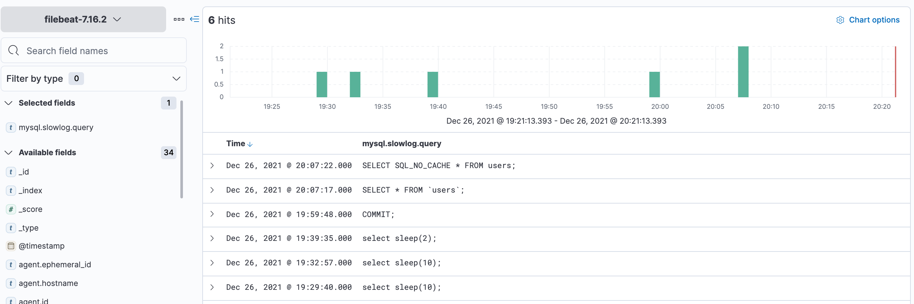
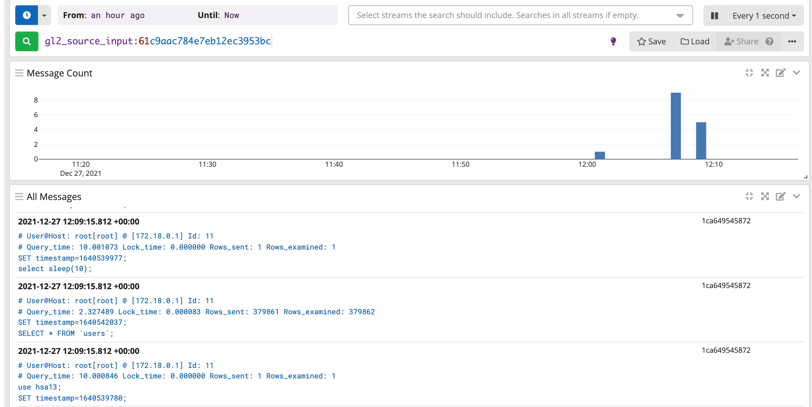

# HSA L13: Logging

## Overview
This is an example project to show how to set up MySQL slow query log,
and configure ELK and GrayLog2 to work with mysql slow query log.

## Getting Started

### Preparation
Run the docker containers and wait while mysql-seeding container is fill out the db table.
```bash
  docker-compose up -d
```

Be sure to use ```docker-compose down -v``` to clean up after you're done with tests.

We will use Filebeat for both setups (ELK and GrayLog2).

#### Filebeat ELK configuration
```yaml
filebeat.config:
  modules:
    path: ${path.config}/modules.d/*.yml
    reload.enabled: false

filebeat.modules:
  - module: mysql
    slowlog:
      enabled: true
      var.paths: ["/var/log/mysql/mysql-slow.log"]

setup.dashboard.enabled: true

setup.kibana.host: "http://kibana:5601"

output.elasticsearch:
  hosts: ["http://elasticsearch:9200"]
  username: "elastic"
  password: "hsa13"
```

#### Filebeat GrayLog2 configuration
```yaml
filebeat.config:
  modules:
    path: ${path.config}/modules.d/*.yml
    reload.enabled: false

filebeat.modules:
  - module: mysql
    slowlog:
      enabled: true
      var.paths: ["/var/log/mysql/mysql-slow.log"]

setup.dashboard.enabled: false

output.logstash:
  hosts: ["graylog:5045"]
```

## Tests

### Run next SQL queries
```
select sleep(10);

SELECT SQL_NO_CACHE * FROM users;

select sleep(5);
```

### ELK Results


### GrayLog2 Results
